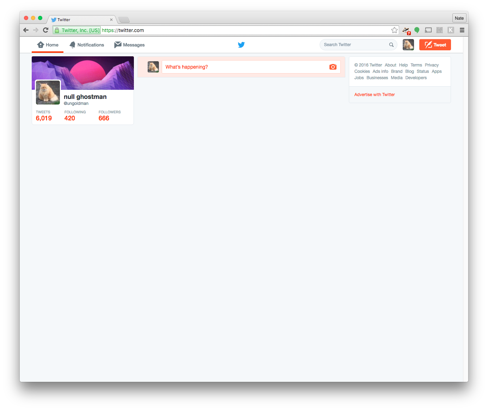

# Kill Tweet Stream

> Save time by hiding the tweet stream on Twitter.

Algorithmic feeds like Twitter's tweet stream and Facebook's news feed are designed to provide a never-ending list of distractions to keep you scrolling while slipping in advertisements targeted at you based on the personal information you've shared and the places you've visited online. It's a negative unrewarding experience that's sometimes hard to look away from.

This extension solves part of the problem by simply hiding the tweet stream. You can still check notifications, send and receive direct messages, visit other user profiles, and other activities as you normally would. The negative experience of the never-ending feed is removed so you can communicate without unnecessary distractions.

Inspired by:

- [The Distraction Industrial Complex](https://blog.dcpos.ch/the-distraction-industrial-complex) by [dcposch](https://github.com/dcposch)
- [Kill News Feed](https://chrome.google.com/webstore/detail/kill-news-feed/hjobfcedfgohjkaieocljfcppjbkglfd) (a chrome extension that hides the facebook news feed)

## Install

**Option 1:**

Install **[Kill Tweet Stream](https://chrome.google.com/webstore/detail/kill-tweet-stream/dmbjkljffdbmcfbigilmnadinlnpkmkk)** via the Chrome Web Store.

**Option 2:**

1. Download a `zip` from the [releases](https://github.com/ungoldman/kill-tweet-stream/releases/) section and unzip it on your local hard drive.
2. Open `chrome://extensions/`.
3. Make sure `Developer mode` is enabled.
4. Click `Load unpacked extension...` and select the directory where you unzipped this extension.

Presto! No more tweets.

## License

[CC0](https://wiki.creativecommons.org/wiki/CC0)
