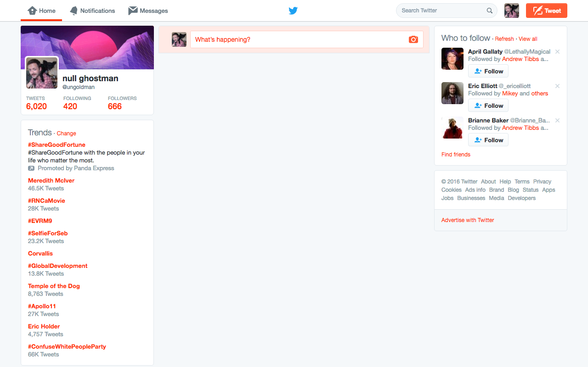

# Kill Tweet Stream

> Save time by hiding the tweet stream on Twitter.

## Why?

Because [Kill All Feeds](https://blog.dcpos.ch/no-feeds).

## Install

**Option 1:**

Install **[Kill Tweet Stream](https://chrome.google.com/webstore/detail/kill-tweet-stream/dmbjkljffdbmcfbigilmnadinlnpkmkk)** via the Chrome Web Store.

**Option 2:**

1. Download a `zip` from the [releases](https://github.com/ungoldman/kill-tweet-stream/releases/) section and unzip it on your local hard drive.
2. Open `chrome://extensions/`.
3. Make sure `Developer mode` is enabled.
4. Click `Load unpacked extension...` and select the directory where you unzipped this extension.

Presto! No more tweets.

## License

[CC0](https://wiki.creativecommons.org/wiki/CC0)
